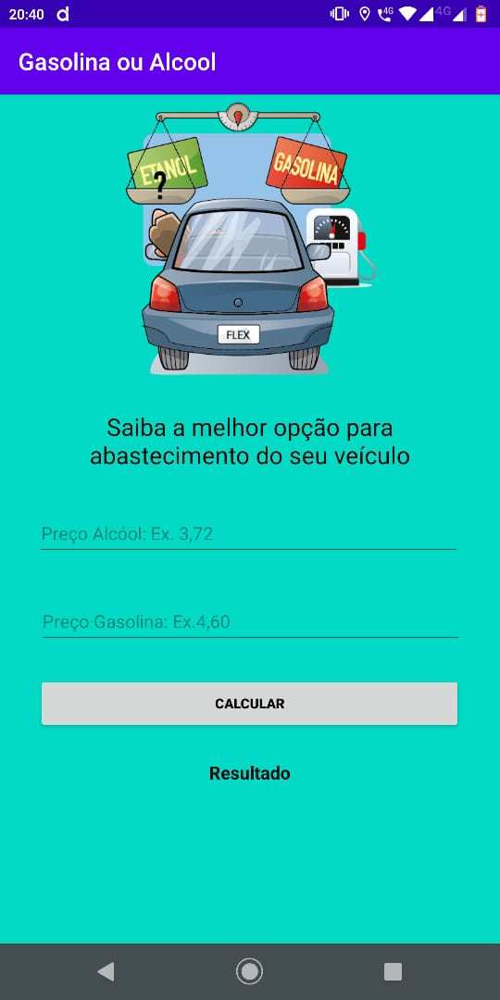

<h1 align="center"> Aplicativo de Sorteio de dados <h1>

<h1>  <h1>

# Indice
- [Sobre](#-sobre)
- [Tecnologias utilizadas](#-tecnologias-utilizadas)

---

# 📋 Sobre
Projeto **Sorteio de dados** é um aplicativo que foi desenvolvido como sugestão da primeira atividade da disciplina de  **Desenvolvimento de aplicativos móveis** da faculdade **Unifametro**  com o intuito de colocarmos em prática o conteúdo estudado.

---

## 🚀 Tecnologias utilizadas 

O projeto foi desenvolvido utilizando as seguintes tecnologias:

- [Android Studio](https://developer.android.com/studio/preview)
- [Java](https://www.java.com/pt_BR/)

---
Este projeto está licenciado nos termos da licença MIT  |  Desenvolvido por 👩‍💻 Janiele Nogueira